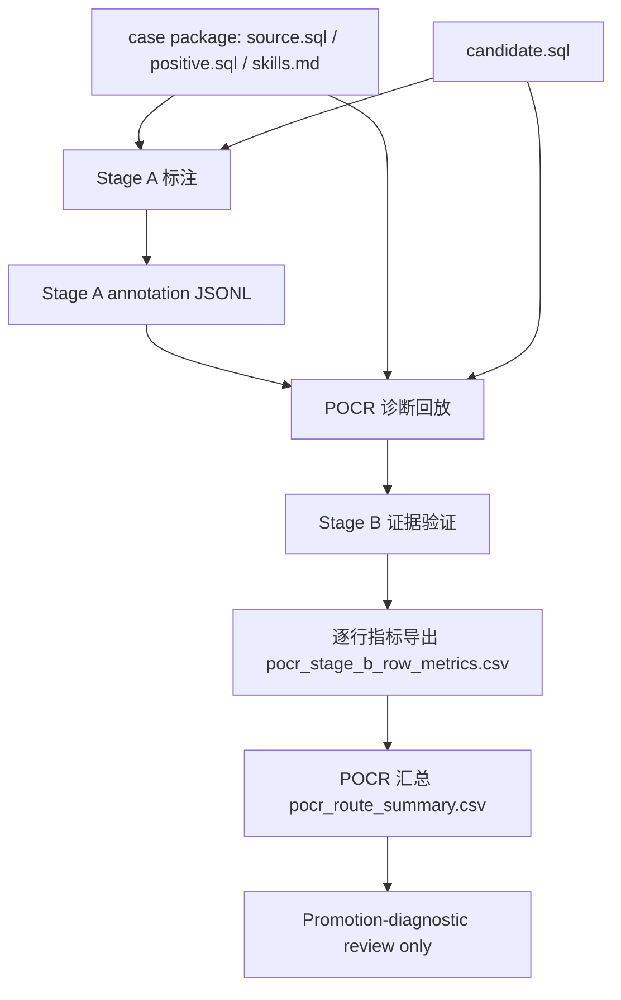

# POCR pipeline 用户说明

本文档用中文优先说明 POCR pipeline。文件名、CLI flag、Python symbol、CSV column name 保持英文，必要时保留双语术语。

POCR 不是 official paper metric。POCR@planned 和 POCR@candidate 仍然是 D039 promotion views。POCR@curated 暂缓，直到存在预先声明并冻结的 curated denominator manifest。Track A 120 不是 leaderboard。

This is not official POCR. No route-level official POCR score is emitted. No paper-facing metric is promoted.

## POCR 是什么

POCR（Positive Operation Coverage Rate）是一个解释性 / 可观察性诊断，用来回答：候选 SQL 是否实现了 case-local `skills.md` 中声明的预期 rewrite operation atoms。

当前仓库中的 POCR 是 promotion-diagnostic support，不是已经冻结的论文指标。它用于帮助人工审查 route 是否实现了预期重写操作，并帮助发现 no-op / source-like candidate 的过度接受风险。

## POCR 不是什么

- POCR 不等于 correctness。正确性仍然需要执行、checker、exact/result-consistency 或正式 verifier 证据。
- POCR 不等于 speed。速度仍然只能在 exact + timed rows 上解释。
- POCR 不是 official paper metric，除非后续有单独授权的 paper-facing promotion 决策。
- POCR 不是 retained evidence promotion。
- POCR 不是 global leaderboard，Track A 120 不是 leaderboard。

## case package 输入角色

- `source.sql`：transformation origin，也是语义 oracle 的 source-side 输入。Stage B 证据验证必须相对 source 判断 candidate 是否真的发生了操作变化。
- `positive.sql`：trusted positive rewrite / target-direction reference evidence。positive SQL 可以帮助判断方向和候选 span 是否对齐，但 positive SQL is reference evidence, not an atom source。
- `skills.md`：唯一的 `operation_atom` 和 `semantic_guard_atom` contract。expected operation atoms 只能来自 case-local root-level `skills.md`。
- `candidate.sql`：method output under evaluation。candidate SQL 不能发明 atoms，也不能因为包含某个 span 就直接得到 operation support。
- SQLGlot no-op 是 candidate/control route，不是 reference。它用于检查 Stage B 是否会错误地把 source-like / low-transform candidate 计为 operation support。

## 术语和阶段

### Stage A 标注（Stage A annotation）

Stage A 标注是 LLM 读取 `source.sql`、`positive.sql`、`candidate.sql` 和 `skills.md` 后生成 atom-level JSON annotations。

API 使用规则：只有显式 live 授权时才允许调用 API。默认用户命令不会自动调用 API，也不会读取 API key。

Stage A annotation alone is not counted。Stage A 只是候选声明，必须经过 Stage B 证据验证。

### POCR 诊断回放（pocr-diagnostic replay）

POCR 诊断回放读取已有的 Stage A annotation JSONL，执行 Stage B evidence validation，并导出诊断行。

API 使用规则：无 API。它不生成新 annotation，不跑 DB/checker/timing，不 rerun baseline。

旧称说明：Stage B replay 旧称；本文档统一称为 POCR 诊断回放，即回放已有 Stage A 标注并执行 Stage B 证据验证。

### Stage B 证据验证（Stage B evidence validation）

Stage B 证据验证检查 atom support 是否有 source-to-candidate transformation evidence。

规则：

- `candidate_sql_span` alone is presence evidence only。
- `source_sql_span` alone is not operation support。
- `positive_sql_span` alone is not operation support。
- operation support 需要 `source_candidate_diff:changed` 和 candidate-specific 或 positive-aligned span 等保守证据组合。
- `semantic_guard_atom` 单独计数，但排除在 operation coverage numerator 和 denominator 之外。

### 逐行指标导出（row metrics export）

逐行指标导出会写：

```text
output/results/<run_id>/pocr/stage_b/pocr_stage_b_row_metrics.csv
```

这个 CSV 是 future aggregation 的 durable input。它是一行一个 route × case_id × engine 的 Stage B 诊断指标，不是官方 route-level POCR。

### POCR 汇总（pocr aggregation）

POCR 汇总读取一个或多个 `pocr_stage_b_row_metrics.csv`，计算 promotion-diagnostic POCR@planned / POCR@candidate route summary，并写：

```text
output/results/<run_id>/pocr/aggregates/pocr_route_summary.csv
```

可选 Markdown report：

```text
output/reports/<run_id>/pocr_route_summary.md
```

POCR 汇总不调用 API，不 replay annotation，不运行 DB/checker/timing，不计算 official POCR，不 promote paper metric，不写 top-level `reports/` 或 `results/`。

## POCR@planned / POCR@candidate / POCR@curated

- `POCR@planned`：denominator-aware promotion view。planned denominator rows 中，no candidate、route mismatch、candidate mismatch、annotation missing、schema-invalid after retry 等 fail-closed 状态以 `OC_i=0` 保留。
- `POCR@candidate`：candidate-quality diagnostic view。无 candidate 的行不进入 candidate denominator；candidate-bound 的 fail-closed 行仍按规则保留。
- `POCR@curated`：POCR@curated 暂缓，状态为 `NA` / `curated_manifest_missing`，直到存在预先声明的 curated denominator manifest。不能从已经生成、执行、exact 的行事后发明 curated denominator。

POCR@planned 和 POCR@candidate 仍然是 D039 promotion views，不是 official paper metric。

## 用户命令示例

POCR 诊断回放：

```bash
sqlrb user pocr-diagnostic \
  --enable-pocr-diagnostic \
  --candidate-root runs/user/<candidate_run>/candidate_sql \
  --method-id <method_id> \
  --route-id <route_id> \
  --engine postgres \
  --run-id <replay_run_id> \
  --output-root output \
  --annotation-jsonl output/results/<annotation_run_id>/pocr/annotations/.../safe_annotation_outputs.jsonl
```

POCR 汇总：

```bash
sqlrb user pocr-aggregate \
  --enable-pocr-diagnostic \
  --row-metrics output/results/<replay_run_id>/pocr/stage_b/pocr_stage_b_row_metrics.csv \
  --run-id <aggregate_run_id> \
  --output-root output
```

多个 row metrics 文件可以重复传入：

```bash
sqlrb user pocr-aggregate \
  --enable-pocr-diagnostic \
  --row-metrics output/results/run_a/pocr/stage_b/pocr_stage_b_row_metrics.csv \
  --row-metrics output/results/run_b/pocr/stage_b/pocr_stage_b_row_metrics.csv \
  --run-id <aggregate_run_id> \
  --output-root output
```

## 输出路径

逐行指标：

```text
output/results/<run_id>/pocr/stage_b/pocr_stage_b_row_metrics.csv
```

汇总：

```text
output/results/<run_id>/pocr/aggregates/pocr_route_summary.csv
```

可选报告：

```text
output/reports/<run_id>/pocr_route_summary.md
```

这些都是 local diagnostic output。不得提交 `output/`，不得更新 top-level `reports/` 或 `results/`。

## 逻辑框图



边界：这条 pipeline 可以产生 promotion-diagnostic evidence，但不能自动产生 official POCR、paper metric、retained evidence、top-level reports/results 或 leaderboard。
